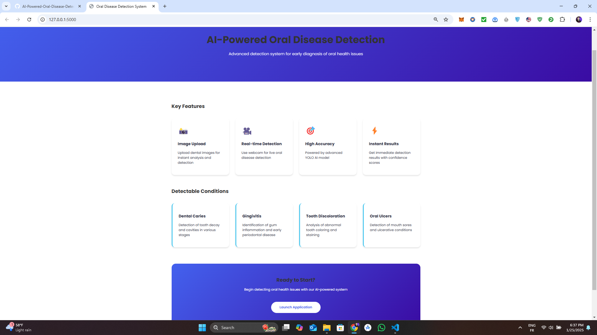
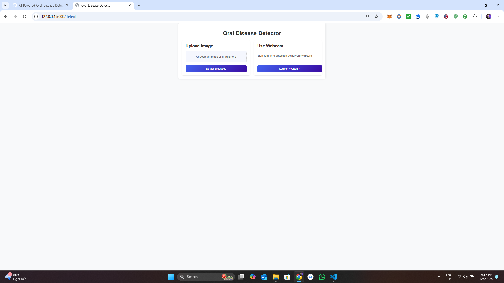
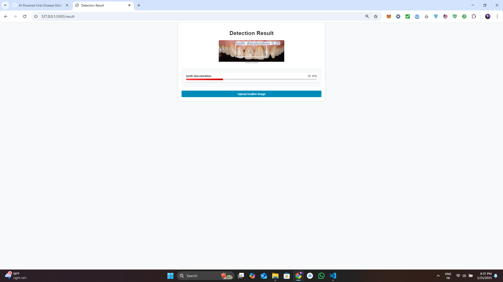
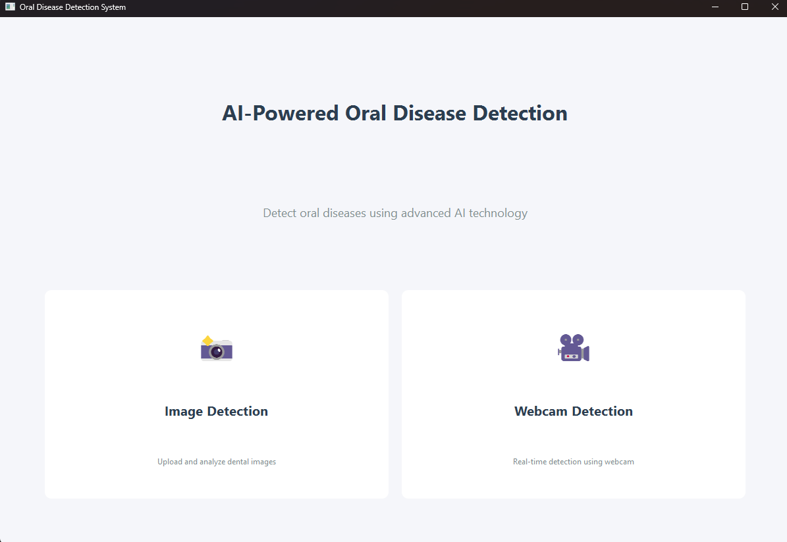
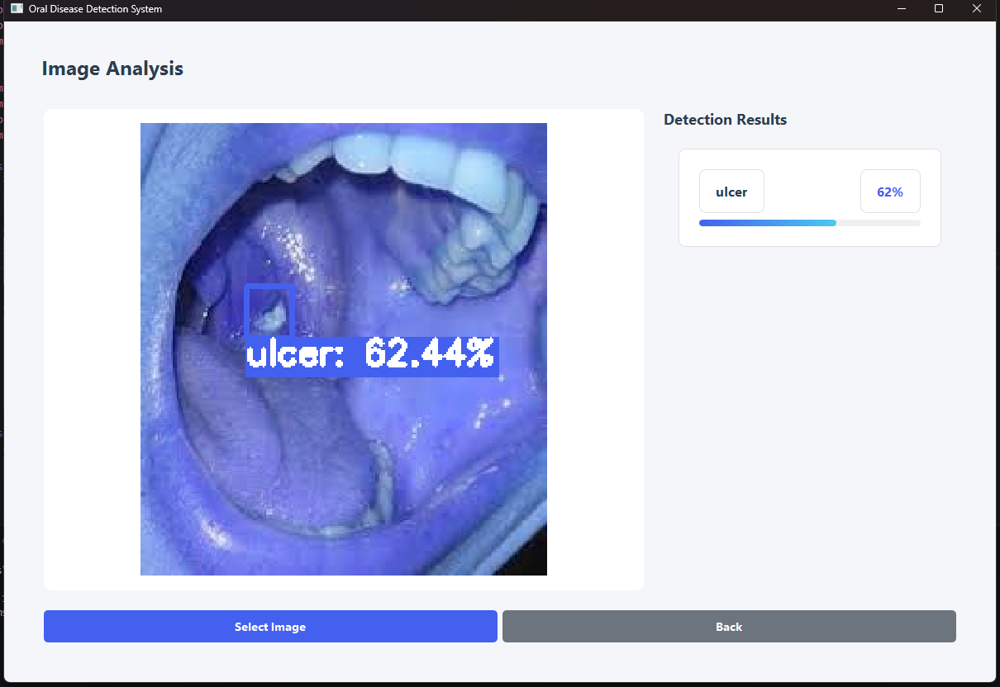

# AI-Powered Oral Disease Detection System

## Overview
This  application uses artificial intelligence to detect various oral diseases through image analysis and real-time webcam detection. Built with Flask and powered by YOLOv8, it provides instant detection of common oral health conditions.

## Features
- **Image Upload Detection**: Upload dental images for instant analysis
- **Real-time Webcam Detection**: Live detection using your device's camera
- **Multiple Disease Detection**: Identifies various oral conditions:
  - Dental Caries
  - Gingivitis
  - Tooth Discoloration
  - Oral Ulcers
- **Confidence Scoring**: Each detection includes a confidence percentage
- **User-friendly Interface**: Clean and intuitive web interface

## Web Application 

## Desktop Application

## Technologies Used
- **Backend**: Python, Flask
- **AI Model**: YOLOv8
- **Frontend**: HTML, CSS , Javascript
- **Image Processing**: OpenCV
- **Deep Learning**: PyTorch (via Ultralytics YOLO)
- **Desktop**: PyQt6
